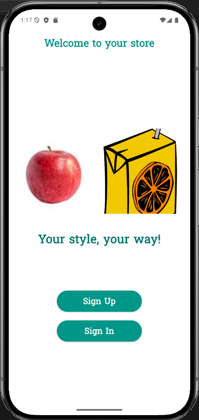
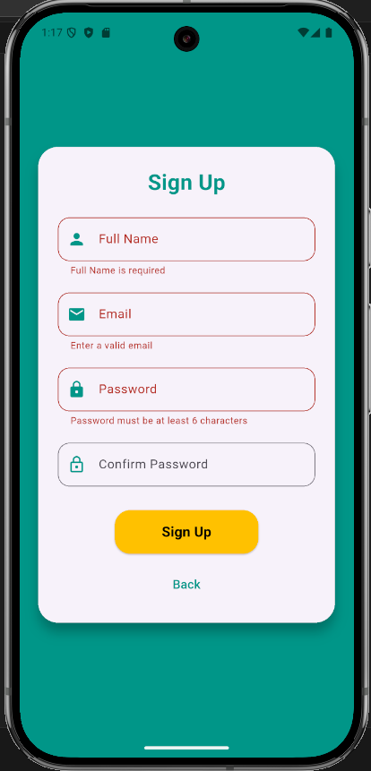
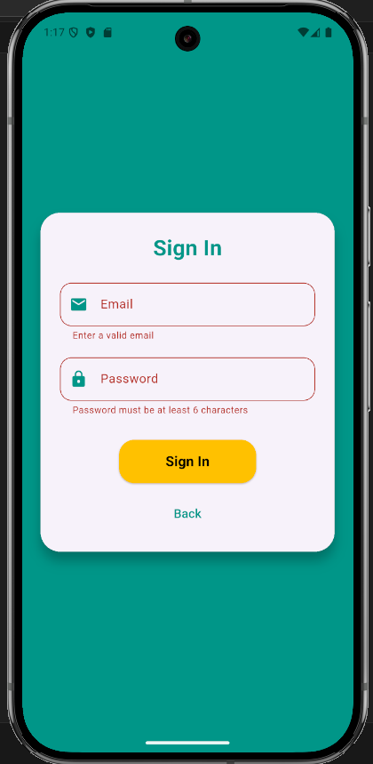
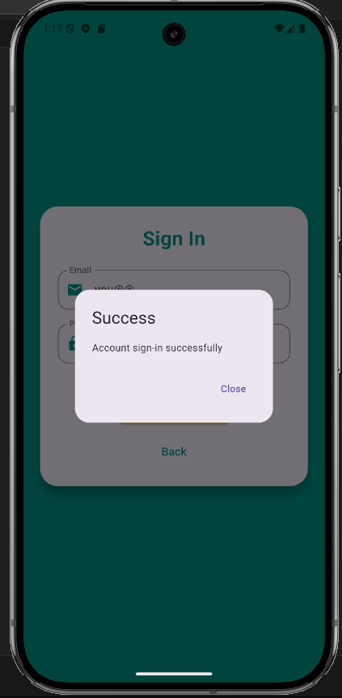
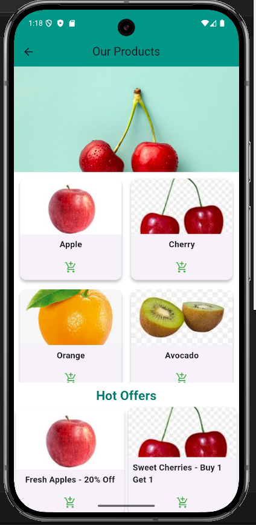
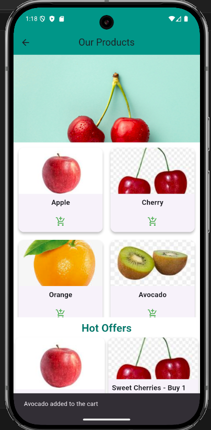

# Flutter Shopping App

## Project overview
Basic Shopping app UI with authentication and products.

## Features
- Sign Up
- Sign In
- View Products
- Add product to cart

## Screenshots
<table>
  <tr>
    <td align="center">
      <br/>
      <em>Intro Page</em>
    </td>
    <td align="center">
      <br/>
      <em>Sign Up with constraints</em>
    </td>
    <td align="center">
      <br/>
      <em>Sign In with constraints</em>
    </td>
  </tr>
  <tr>
    <td align="center">
      <br/>
      <em>Notification after signing in</em>
    </td>
    <td align="center">
      <br/>
      <em>Home Page with products and offers</em>
    </td>
    <td align="center">
      <br/>
      <em>Adding a product to cart</em>
    </td>
  </tr>
</table>

## Setup & run
Requirements:
- Flutter SDK (stable) — e.g., 3.x or later
- Android Studio / Xcode or emulator

Commands:
```bash
flutter pub get
flutter run
